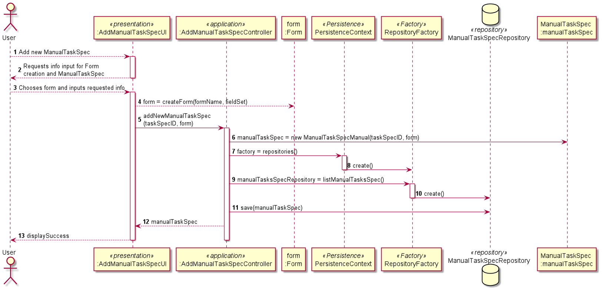

# US1005 - Desenvolvimento da componente representativa de uma tarefa manual
=======================================

# 1. Requisitos

**US1006**  Como Gestor de Projeto, eu pretendo que seja desenvolvida a componente representativa de uma tarefa automática dedicada à execução de um script no âmbito de um pedido e que a mesma seja adicionada à biblioteca de atividades típicas do sistema para, dessa forma, pinição de fluxos de atividades.

# 2. Análise

No âmbito da especificação de um serviço, é também especificada a tarefa a realizar quando este for solicitado. No caso das automáticas:

* Tem um ID único.
* Contém um Script fornecido pelo especificador do serviço.

# 3. Design

## 3.1. Realização da Funcionalidade

Segue o modelo do SD acima (da US1005).
Em vez de criar e guardar uma ManualTaskSpec, será uma AutoTaskSpec.

Esta AutoTaskSpec contém uma designação também mas, em vez de um formulário, contém um script.

## 3.2. Diagrama de Classes

Não necessário.

## 3.3. Padrões Aplicados

Estrutura baseada em camadas:
* Padrão UI/Presentation
* Padrão Controller
* Padrão Persistence
* Padrão Factory
* Padrão Repository

## 3.4. Testes 

-
# 4. Implementação

Atributos e construtor

    @DiscriminatorValue("Automatic")
    @Entity
    public class AutoTaskSpec extends TaskSpec{

    private String designation;
    private Script script;

    public AutoTaskSpec(String designation, Script script) {
        super();
        this.designation = designation;
        this.script = script;
    }

Controller

    @UseCaseController
    public class AddAutoTaskSpecController {

    public AutoTaskSpec addAutoTaskSpec(String designation, Script script){
        return new AutoTaskSpec(designation,script);
    }

    public Script addScript(String script){
        return new Script(script);
    }

    }

# 5. Integração/Demonstração

Esta funcionalidade tinha a particularidade de ter a sua classe de domínio a extender de outra classe. Para isso, anotações "@" foram adicionadas em ambas as classes.

# 6. Observações

A UI não foi criada, devido a estar integrada na especificação do serviço.

Muito semelhante à US1005, daí usar o mesmo SD.

