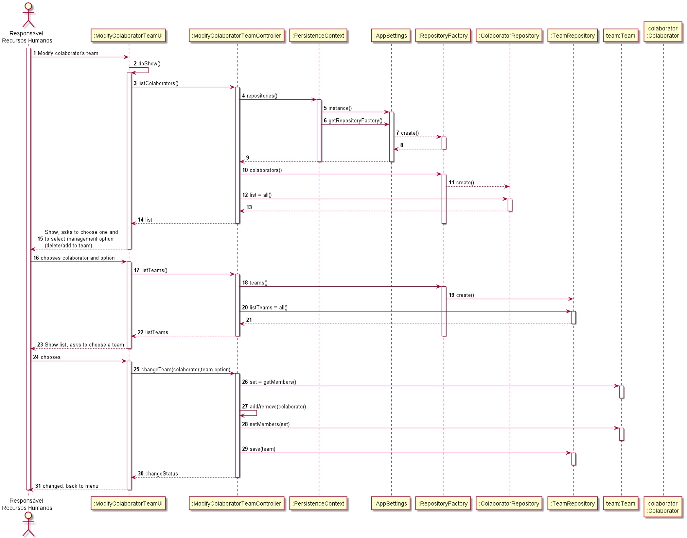

# US2053
=======================================

# 1. Requisitos

**2.0.5.3** Como Responsável de Recursos Humanos (RRH) pretendo:

- Associar um colaborador a uma equipa;

- Remover um colaborador de uma equipa;

# 2. Análise

O RRH terá, depois do login, um menu com a opção de modificar equipa de colaboradores. 

Ao selecionar essa opção, será disponibilizada uma lista com os colaboradores. Após a escolha do mesmo e da opção (Remover/Adicionar a equipa), existem 2 fluxos:
*   Adicionar: aparece uma lista de equipas, é selecionar e a alteração foi feita;
*   Remover: o colaborador é removido da equipa automaticamente.

# 3. Design

## 3.1. Realização da Funcionalidade

## 3.2. Diagrama de Classes

Não necessário para um caso de uso deste tamanho.

## 3.3. Padrões Aplicados

Para a resolução deste caso de uso, foram utilizadas as classes Controller, UI e Persistance Context ,e as interfaces Repository.

Todas as classes usadas (excluindo as extensões/implementações das classes/interfaces):
*   ModifyCollaboratorUI
*   ModifyCollaboratorController
*   PersistanceContext
*   AppSettings
*   RepositoryFactory
*   Collaborator

Todas as Interfaces usadas (excluindo as extensões/implementações das classes/interfaces):
*   CollaboratorRepository
*   TeamRepository

# 4. Implementação

    public List<Collaborator> listCollaborators(){
        List<Collaborator> list = new ArrayList<>();
        cr = rf.collaborators();
        cr.findAll().forEach(list::add);
        return list;
    }

    public List<Team> listTeams(){
        List<Team> list = new ArrayList<>();
        tr = rf.teams();
        tr.findAll().forEach(list::add);
        return list;
    }

    public Team changeTeam(Team team, Collaborator col, int option) {
        Set<Collaborator> collaboratorSet = team.getMembers();
        if (option ==1){
            collaboratorSet.add(col);
        } else if(option==2){
            collaboratorSet.remove(col);
        }
        team.setMembers(collaboratorSet);
        return tr.save(team);
    }

# 5. Integração/Demonstração

Para a realização deste caso de uso, o uso de objetos tipo Team e Collaborator foram necessários.

A ligação com a base de dados foi feita 2 vezes, na busca das equipas e dos colaboradores.

A Team tem, não só um Set de Collaborators, como também um colaborador responsável.

# 6. Observações

Este UC está implementado, porém, futuramente, poderão ser necessárias as seguintes melhorias:

* Acesso ao menu apenas por RRH;
* Ligação diferente entre Team e Collaborator.

