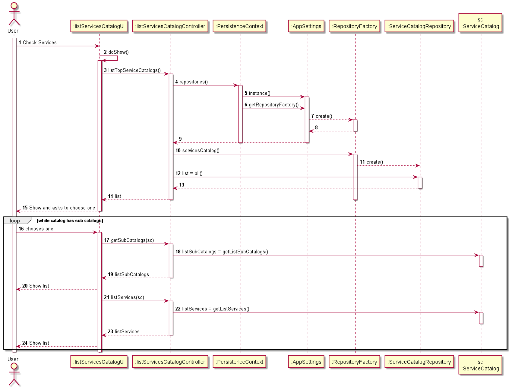

# US3001
=======================================

# 1. Requisitos

**3.0.0.1** Como Cliente pretendo:

- Observar Catálogos de Serviços que me são disponibilizados;

- Consultar Serviços que me são disponibilizados;

A interpretação feita deste requisito foi no sentido de criar uma forma do Cliente poder consultar os Catálogos de Serviços e os Serviços embutidos nos mesmos.

# 2. Análise

O Cliente terá, depois de efetuado o login, uma opção no menu para a consulta ao que foi especificado.

Este apenas terá acesso a Serviços e Catálogos disponibilizados de acordo com as suas permissões. -> Não implementado ainda.

# 3. Design

## 3.1. Realização da Funcionalidade

## 3.2. Diagrama de Classes

Não necessário para este caso de uso.

## 3.3. Padrões Aplicados

Para a resolução deste caso de uso, foram utilizadas as classes Controller, UI e Persistance Context ,e as interfaces Repository.

Todas as classes usadas (excluindo as extensões/implementações das classes/interfaces):
*   ListServiceCatalogsUI
*   ListServiceCatalogsController
*   PersistanceContext
*   AppSettings
*   RepositoryFactory
*   ServiceCatalog
*   Service

Todas as Interfaces usadas (excluindo as extensões/implementações das classes/interfaces):
*   ServiceCatalogRepository
*   ServiceRepository

# 4. Implementação

    public List<ServiceCatalog> listTopServiceCatalogs(){
        List<ServiceCatalog> list = new ArrayList<>();
        scr = rf.serviceCatalogs();
        scr.findTopCatalogs().forEach(list::add);
        return list;
    }

    private boolean subCatalogsMenu(ServiceCatalog serviceCatalog){
        boolean back = true;
        while(back) {
            assert serviceCatalog.getListServices() != null;
            List<Service> listS = new ArrayList<>(serviceCatalog.getListServices());
            assert serviceCatalog.getListSubCatalogs() != null;
            List<ServiceCatalog> listCS = new ArrayList<>(serviceCatalog.getListSubCatalogs());
            int contador = 0;
            for (ServiceCatalog sc : listCS) {
                System.out.printf("(Catalog) %d -> %s - %s\n", contador, sc.getTitle(), sc.identity());
                contador++;
            }

            for (Service s : listS) {
                System.out.printf("(Service) %d -> %s - %s\n", contador, s.getName(), s.identity());
                contador++;
            }
            System.out.printf("%d -> Back.\n", contador);
            int option = Console.readInteger("Select catalog or service.\n");
            while (option < 0 || option > listCS.size()+listS.size()) {
                System.out.println("Invalid option. Try again.");
                option = Console.readInteger("Select collaborator.\n");
            }
            if (option == contador) {
                return true;
            } else if(option<listCS.size()){
                ServiceCatalog sc = listCS.get(option);
                subCatalogsMenu(sc);
            } else {
                Service s = listS.get(option);
                System.out.printf("(Service) %d -> %s - %s\n", contador, s.getName(), s.identity());
                System.out.println("Not implemented yet!\n");
            }
        }
        return true;
    }

# 5. Integração/Demonstração

Sendo que eram necessários objetos das classes ServiceCatalog e Service da base de dados, foi necessário o acesso à mesma, indo buscar os catálogos de serviço.

Uma vez que o critério de acesso não se encontra implementado, também foi necessária a criação de uma variável boolean para saber se aquele catálogo era ou não primário, de modo a aparecer logo.

# 6. Observações

Futuramente, será necessário reformular o caso de uso nos seguintes modos:

* implementação do critério de acesso;
* remoção da variável de identificação de catálogo primário;
* menor manuseamento de dados a partir da UI.

