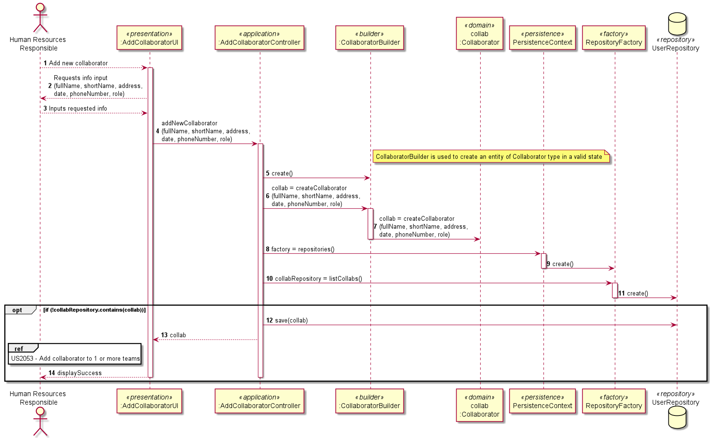

# US2051 - Especificar novo colaborador
=======================================

# 1. Requisitos

**US2051** Como Responsável de Recursos Humanos (RRH), eu pretendo proceder à especificação de um novo colaborador de modo a que este possa, posteriormente, aceder e usar o sistema.

* Critérios de Aceitação:
    * Deve contemplar a associação a uma ou mais equipas.
    * Devem reutilizar o componente de gestão de utilizadores disponibilizado em EAPLI.

# 2. Análise

O RRH terá, depois de efetuar login, um menu que, entre outras, terá a opção de adicionar um colaborador ao sistema.

* Ao selecionar essa opção, o sistema vai pedir a informação necessária para a criação do respetivo colaborador. Uma lista de equipas será apresentada para que o RRH possa escolher uma, ou mais, à qual o colaborador será integrado (US2053).
* Será também criado um utilizador (user) de sistema (Use Case já implementado no eapli.base).

# 3. Design

## 3.1. Realização da Funcionalidade

 
* **Diagrama de sequência referente à adição de um novo colaborado no sistema.**

## 3.2. Diagrama de Classes

* Não criado para este caso de uso.

## 3.3. Padrões Aplicados

* Padrão UI/Presentation
* Padrão Controller
* Padrão Builder
* Padrão Persistence
* Padrão Factory
* Padrão Repository

## 3.4. Testes 
*Nesta secção deve sistematizar como os testes foram concebidos para permitir uma correta aferição da satisfação dos requisitos.*

**Teste 1:** Verificar que não é possível criar uma instância da classe Exemplo com valores nulos.

	@Test(expected = IllegalArgumentException.class)
		public void ensureNullIsNotAllowed() {
		Exemplo instance = new Exemplo(null, null);
	}

# 4. Implementação

*Nesta secção a equipa deve providenciar, se necessário, algumas evidências de que a implementação está em conformidade com o design efetuado. Para além disso, deve mencionar/descrever a existência de outros ficheiros (e.g. de configuração) relevantes e destacar commits relevantes;*

*Recomenda-se que organize este conteúdo por subsecções.*

# 5. Integração/Demonstração

*Nesta secção a equipa deve descrever os esforços realizados no sentido de integrar a funcionalidade desenvolvida com as restantes funcionalidades do sistema.*

# 6. Observações

*Nesta secção sugere-se que a equipa apresente uma perspetiva critica sobre o trabalho desenvolvido apontando, por exemplo, outras alternativas e ou trabalhos futuros relacionados.*

